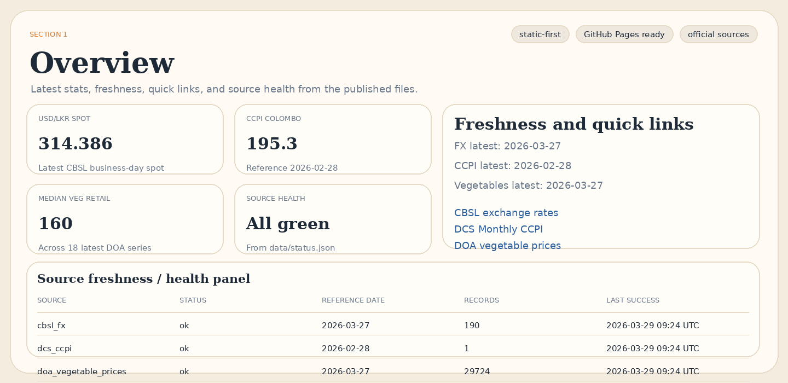
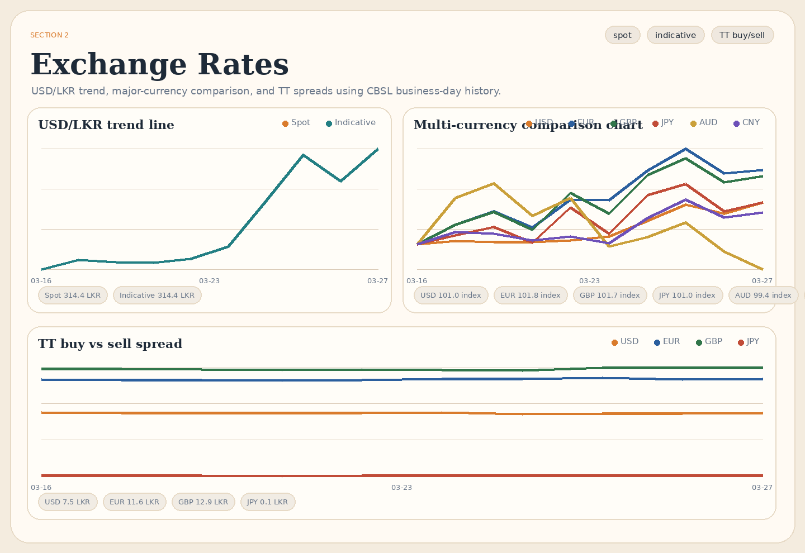
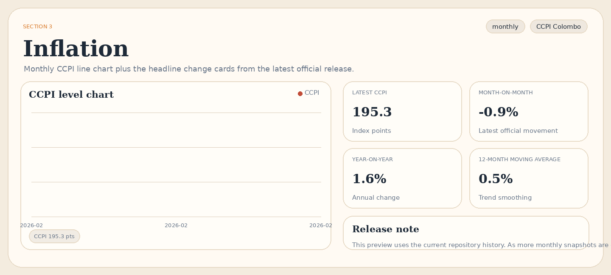
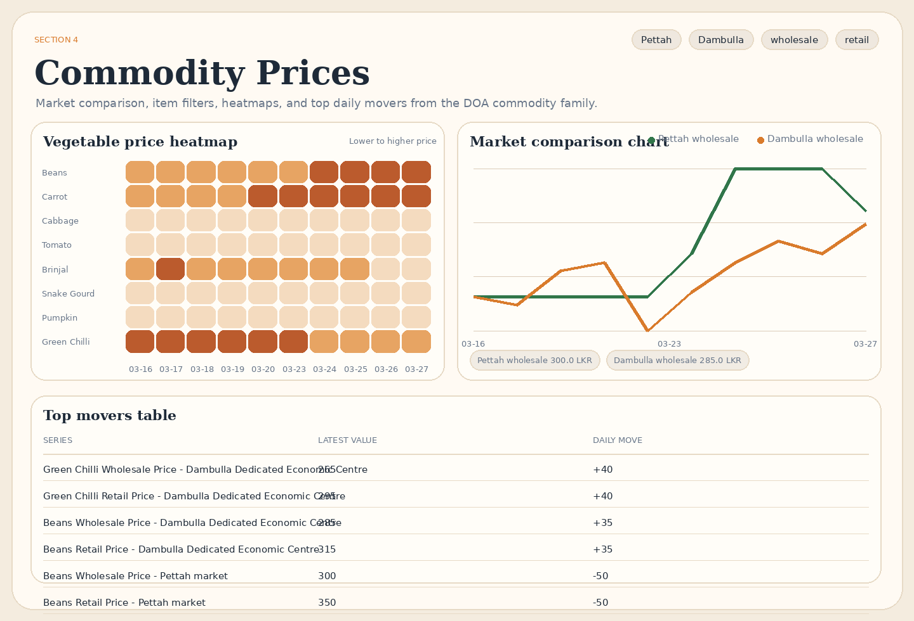

# Sri Lanka Macro Publisher


## Dashboard Previews



## About

Static-data publishing pipeline for official Sri Lankan macroeconomic datasets. Fetches data from official public sources, normalizes observations into a canonical schema, validates records, and writes machine-readable JSON and CSV outputs into Git-tracked files.

**Data Sources:** CBSL, DCS, DOA (official government publications)

**Update Frequency:** CBSL FX every 3 hours on weekdays, DOA daily, DCS CCPI daily

## Latest Snapshot

**Last updated:** 2026-03-29 09:25:02 UTC
**Total records:** 29,915

| Metric | Value | Reference Date |
|--------|-------|----------------|
| USD/LKR Spot | 314.386 | 2026-03-27 |
| CCPI Colombo | 195.3 | 2026-02-28 |
| Median Veg Retail | 160 LKR/kg | 2026-03-27 |

## Inflation

| Measure | Value |
|---------|-------|
| CCPI Level | 195.3 |
| Month-on-Month | -0.9% |
| Year-on-Year | 1.6% |
| 12-Month Moving Avg | 0.5% |

## Exchange Rates (USD/LKR Spot)

| Date | Rate |
|------|------|
| 2026-03-27 | 314.386 |
| 2026-03-26 | 313.509 |
| 2026-03-25 | 314.217 |
| 2026-03-24 | 312.964 |
| 2026-03-23 | 311.747 |
| 2026-03-20 | 311.408 |
| 2026-03-19 | 311.300 |
| 2026-03-18 | 311.314 |
| 2026-03-17 | 311.378 |
| 2026-03-16 | 311.133 |

## Major Currencies (Indicative Rates)

| Currency | LKR Rate | Date |
|----------|----------|------|
| USD | 314.39 | 2026-03-27 |
| EUR | 362.77 | 2026-03-27 |
| GBP | 419.42 | 2026-03-27 |
| JPY | 1.97 | 2026-03-27 |
| AUD | 216.71 | 2026-03-27 |
| CNY | 45.46 | 2026-03-27 |

## Vegetable Prices (Latest)

*Reference date: 2026-03-27*

### Pettah Wholesale

| Item | Price (LKR/kg) |
|------|----------------|
| Beans | 300 |
| Brinjal | 120 |
| Cabbage | 100 |
| Carrot | 300 |
| Green Chilli | 250 |
| Lime | 100 |
| Pumpkin | 140 |
| Snake Gourd | 130 |
| Tomato | 70 |

## Source Health

| Source | Status | Reference Date | Records | Last Success |
|--------|--------|----------------|---------|--------------|
| cbsl_fx | ok | 2026-03-27 | 190 | 2026-03-29 09:24 UTC |
| dcs_ccpi | ok | 2026-02-28 | 1 | 2026-03-29 09:24 UTC |
| doa_vegetable_prices | ok | 2026-03-27 | 29,724 | 2026-03-29 09:24 UTC |

## Dashboard Details

### Exchange Rates



### Inflation



### Commodity Prices



## Data Layout

```text
data/
  latest/        Latest snapshot per family (JSON)
  history/        History CSVs with stable column order
  normalized/     Canonical JSON Lines snapshots
  status.json     Source health summary
```

## Official Sources

- CBSL exchange rates: <https://www.cbsl.gov.lk/en/rates-and-indicators/exchange-rates>
- DCS Inflation and Prices: <https://www.statistics.gov.lk/InflationAndPrices/StaticalInformation>
- DOA vegetable prices: <https://infohub.doa.gov.lk/vegetable-prices/>

---


[](https://opensource.org/licenses/MIT)
